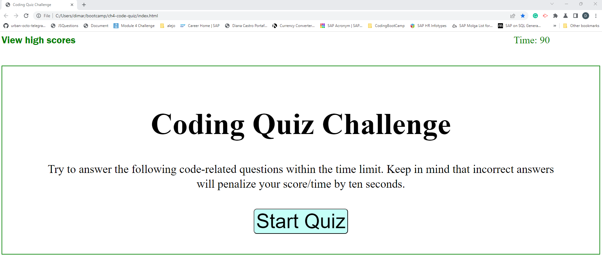
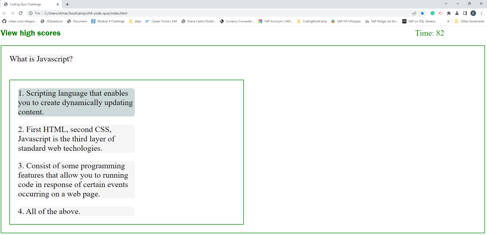
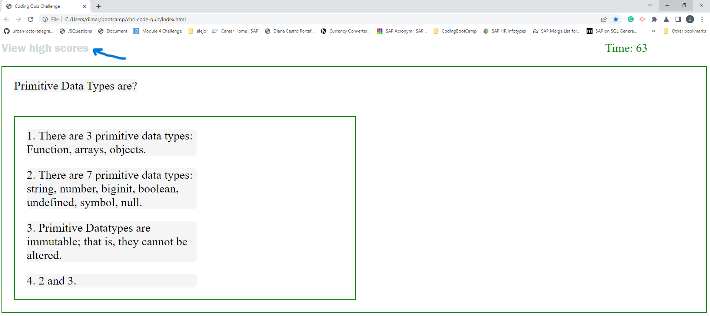
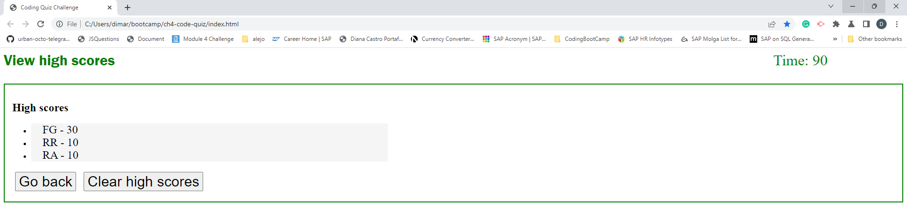
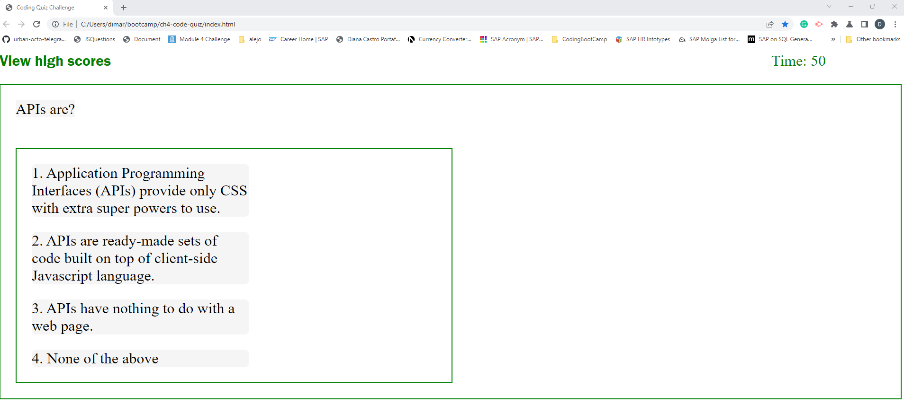
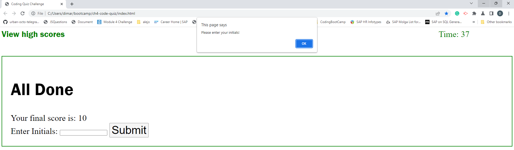
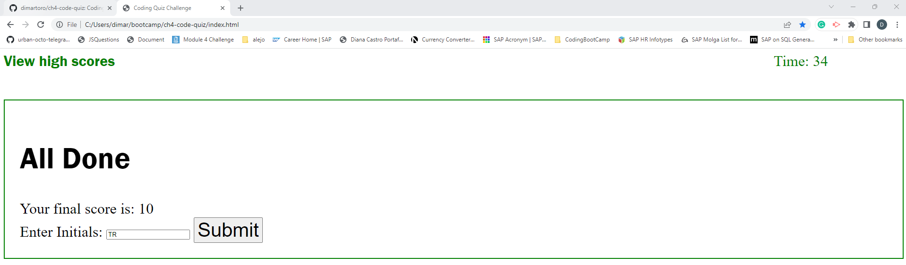
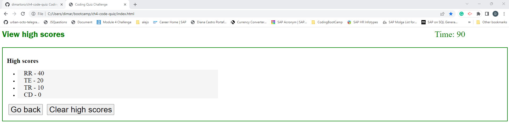

# Coding Quiz Challenge

# Javascript Coding Quiz Challenge

## Description

The Coding Quiz presents the user with a timed Quiz with 5 questions and 4 multiple answer options. When the user clicks the start quiz button
the timer is activated in 90 seconds and starts decrementing by 1 second. If the user responds correctly, receives 10 points, if the user
responds incorrectly is penalized by reducing the timer by 10 seconds. The quiz ends when the timer reaches zero or the user responds to all questions,
whatever happens first. The scores can be accessed at the end of the quiz or from the View High Scores. The scores will be stored in the local storage
allowing the user to access and compare in descending order his/her score against the scores of other users.

## Table of Contents

- [Installation](#installation)
- [Usage](#usage)
- [Credits](#credits)
- [License](#license)

## Installation

1. Created a new repository on GitHub
2. Cloned it to my local repository using git bash.
3. Started HTML, CSS and Javascript coding on my local repository and added, committed and pushed started code to my remote repository.
4. Created 4 feature branches to commit and push changes from my local repo to my remote repo to keep my backups safe.
5. Created the Readme File.

## Usage 

 Coding Quiz p1
 Coding Quiz p2
 Coding Quiz p3
 Coding Quiz p4
 Coding Quiz p5
 Coding Quiz p6
 Coding Quiz p7
 Coding Quiz p8

## Credits

https://developer.mozilla.org/en-US/docs/Web/JavaScript/Reference/Statements

https://developer.mozilla.org/en-US/docs/Web/API/setTimeout

https://www.javatpoint.com/javascript-events

https://www.w3schools.com/jsref/event_onclick.asp

https://www.semrush.com/blog/semantic-html5-guide/

sorting an array of objects:

https://stackoverflow.com/questions/1129216/sort-array-of-objects-by-string-property-value

sorting an array of objects:

https://levelup.gitconnected.com/array-sort-method-and-its-gotchas-5859ece92e8d

## License

Please refer to the License in the repository.
